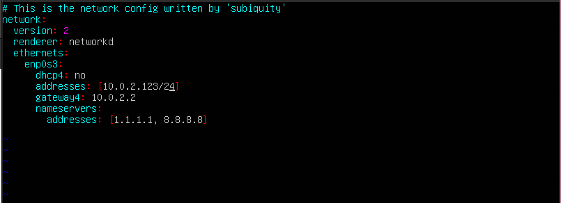

## Part 1. Установка ОС
**== Задание ==**

####  Установить  **Ubuntu 20.04 Server LTS**  без графического интерфейса. (Используем программу для виртуализации - VirtualBox)
###### Результат выполнения команды cat etc/issue]

## Part 2. Создание пользователя
**== Задание ==**
####  Создать пользователя, отличного от пользователя, который создавался при установке. Пользователь должен быть добавлен в группу `adm`.
###### Создание пользователя new_user и добавление его в группу adm

###### Результат выполнения команды cat etc/passwd

## 3. Настройка сети ОС
**== Задание ==**
#### 1. Задать название машины вида user-1.

###### Название машины было изменено при помощи sudo vim etc/hostname
#### 2. Установить временную зону, соответствующую вашему текущему местоположению.
######  Установлена новая временная зона Europe/Moscow при помощи команды timedatectl set-timezone

#### 3. Вывести названия сетевых интерфейсов с помощью консольной команды.
###### Список сетевых интерфейсов выведен командой ip link show.

***_lo_ (loopback device)** – виртуальный интерфейс, присутствующий по умолчанию в любом Linux. Он используется для отладки сетевых программ и запуска серверных приложений на локальной машине. С этим интерфейсом всегда связан адрес _127.0.0.1_. У него есть dns-имя – _localhost_.*
#### 4. Используя консольную команду получить ip адрес устройства, на котором вы работаете, от DHCP сервера.
###### Получение адреса от DHCP сервера (флаг -v дает дополнительный вывод)

**_DHCP_** *(англ. Dynamic Host Configuration Protocol — протокол динамической настройки узла)* — прикладной протокол, позволяющий сетевым устройствам автоматически получать IP-адрес и другие параметры, необходимые для работы в сети TCP/IP. Данный протокол работает по модели «клиент-сервер».

#### 5. Определить и вывести на экран внешний ip-адрес шлюза (ip) и внутренний IP-адрес шлюза, он же ip-адрес по умолчанию (gw).
###### Получение внешнего ip-адреса шлюза

###### Получение внутреннего iP-адреса шлюза

#### 6. Задать статичные (заданные вручную, а не полученные от DHCP сервера) настройки ip, gw, dns (использовать публичный DNS серверы, например 1.1.1.1 или 8.8.8.8)
###### - Для задания статичных настроек редактируем файл /etc/netplan/00-installer-config.yaml sudo netplan apply применяем изменения

#### 7. Перезагрузить виртуальную машину. Убедиться, что статичные сетевые настройки (ip, gw, dns) соответствуют заданным в предыдущем пункте.
###### Новый IP адрес после перезагрузки машины остался на месте. Проверяем командой ip addr show dev enp0s3

###### Теперь пингуем удаленные хосты

