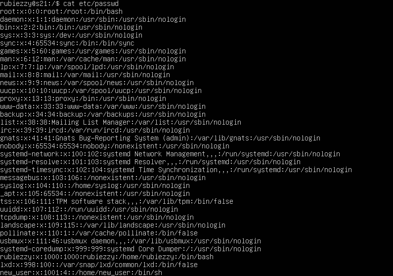
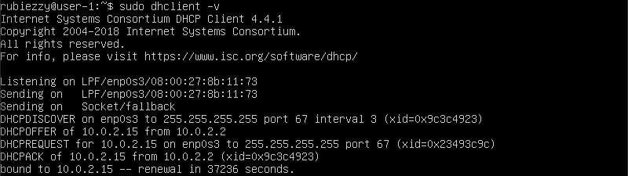
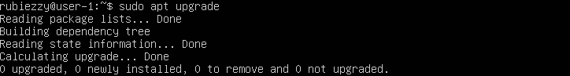

## Part 1. Установка ОС

****== Задание ==****

####  Установить  ****Ubuntu 20.04 Server LTS****  без графического интерфейса. (Используем программу для виртуализации - VirtualBox)

###### Результат выполнения команды `cat etc/issue`

## Part 2. Создание пользователя

****== Задание ==****

####  Создать пользователя, отличного от пользователя, который создавался при установке. Пользователь должен быть добавлен в группу `adm`.

###### Создание пользователя new_user и добавление его в группу adm

###### Результат выполнения команды `cat etc/passwd`

## 3. Настройка сети ОС

****== Задание ==****

#### 1. Задать название машины вида user-1.
###### Название машины было изменено при помощи sudo vim etc/hostname

#### 2. Установить `временную зону`, соответствующую вашему текущему местоположению.

######  Установлена новая временная зона Europe/Moscow при помощи команды timedatectl set-timezone

#### 3. Вывести названия сетевых интерфейсов с помощью консольной команды.

###### Список сетевых интерфейсов выведен командой ip link show.

**_lo_** _(loopback device)– виртуальный интерфейс, присутствующий по умолчанию в любом Linux. Он используется для отладки сетевых программ и запуска серверных приложений на локальной машине. С этим интерфейсом всегда связан адрес 127.0.0.1. У него есть dns-имя –localhost._

#### 4. Используя консольную команду получить ip адрес устройства, на котором вы работаете, от DHCP сервера.

###### Получение адреса от DHCP сервера (флаг -v дает дополнительный вывод)

**_DHCP_** _(англ. Dynamic Host Configuration Protocol — протокол динамической настройки узла)_* — прикладной протокол, позволяющий сетевым устройствам автоматически получать IP-адрес и другие параметры, необходимые для работы в сети TCP/IP. Данный протокол работает по модели «клиент-сервер»._

#### 5. Определить и вывести на экран внешний ip-адрес шлюза (ip) и внутренний IP-адрес шлюза, он же ip-адрес по умолчанию (gw).

###### Получение внешнего ip-адреса шлюза

###### Получение внутреннего iP-адреса шлюза

#### 6. Задать статичные (заданные вручную, а не полученные от DHCP сервера) настройки `ip, gw, dns` (использовать публичный DNS серверы, например 1.1.1.1 или 8.8.8.8)

###### Для задания статичных настроек редактируем файл /etc/netplan/00-installer-config.yaml и sudo netplan apply применяем изменения

#### 7. Перезагрузить виртуальную машину. Убедиться, что статичные сетевые настройки (ip, gw, dns) соответствуют заданным в предыдущем пункте.

###### Новый IP адрес после перезагрузки машины остался на месте. Проверяем командой ip addr show dev enp0s3

###### Теперь пингуем удаленные хосты `1.1.1.1` и `ya.ru`

## Part 4. Обновление ОС

**== Задание ==**
##### Обновить системные пакеты до последней на момент выполнения задания версии.
###### Повторный вызов команды `sudo apt upgrade`

## Part 5. Использование команды **sudo**

**sudo** *(англ. Substitute  User and  do, дословно «подменить пользователя и выполнить») — программа для системного администрирования UNIX-систем, позволяющая делегировать те или иные привилегированные ресурсы пользователям с ведением протокола работы.*

**== Задание ==**
##### Разрешить пользователю, созданному в  Part 2, выполнять команду sudo.
###### Редактируем файл `/etc/sudoers`

###### От имени new_user редактируем /etc/hostname при помощи команды `sudo -u new_user sudo vim /etc/hostname` и получаем новый hostname

## Part 6. Установка и настройка службы времени
**== Задание ==**

##### Настроить службу автоматической синхронизации времени.
###### Вывод времени часового пояса, в котором я нахожусь

###### Добавлена синхронизация времени c NTP при помощи `timedatectl set-ntp true`

## Part 7. Установка и использование текстовых редакторов
**== Задание ==**
---
##### Используя каждый из трех выбранных редакторов, создайте файл _test_X.txt_, где X -- название редактора, в котором создан файл. Напишите в нём свой никнейм, закройте файл с сохранением изменений.
---
###### Для выхода с сохранением нажимаем `esc`, затем `:wq`

###### Для выхода с сохранением нажимаем `ctrl x`,  затем выбираем сохранить изменения клавишей `y` и `enter`

###### Для выхода с сохранением нажимаем `ctrl k`,  затем `q` и `y` для сохранения изменений

---
##### Используя каждый из трех выбранных редакторов, откройте файл на редактирование, отредактируйте файл, заменив никнейм на строку "21 School 21", закройте файл без сохранения изменений.
---

###### Для выхода без сохранения нажимаем `esc`, затем `:q!`

###### Для выхода без сохранения нажимаем `ctrl x`, затем выбираем не сохранять изменения клавишей `n` 

###### Для выхода без сохранения нажимаем `ctrl k`,  затем `q` и `n` для того, чтобы не сохранять изменения

---
##### Используя каждый из трех выбранных редакторов, отредактируйте файл ещё раз (по аналогии с предыдущим пунктом), а затем освойте функции поиска по содержимому файла (слово) и замены слова на любое другое.
---

###### Переходим в режим поиска `/` и вводим слово

###### Переходим в режим поиска `ctrl w` и вводим слово,  нажимаем `enter`

###### Переходим в режим поиска `ctrl kf` и вводим слово,  нажимаем `enter`

---
##### Замена слова на любое другое
---

###### Заменяем все вхождения шаблона командой `:%s/i/we`

###### Переходим в режим поиска `ctrl w` и вводим слово,  нажимаем `ctrl r`, чтобы начать поиск для замены, вводим слово, нажимаем `enter`,  вводим слово, на которое собираемся его заменить и клавишу  `y` для подтверждения замены

###### Переходим в режим поиска `ctrl kf` и вводим слово,  нажимаем `enter`, затем `r` для замены, вводим слово, на которое хотим заменить и подтверждаем замену `y`

## Part 8. Установка и базовая настройка сервиса **SSHD**
**== Задание ==**

#### 1. Устанавливаем службу SSHd при помощи `sudo apt-get install ssh`

#### 2. Добавляем автостарт службы при загрузке системы `sudo systemctl enable sshd`

#### 3. Перенастраиваем службу SSHd на порт 2022 путем изменения файла `/etc/ssh/sshd_config.d` и перезапускаем сервер `systemctl restart sshd`

#### 4. Используем команду ps, чтобы вывести список всех процессов и отфильтровать вывод с помощью grep. Статус «listener» процесса sshd в выводе этой команды означает, что SSH работает

*Ключи, с которыми используется ps :*  
 ***a*** all processes with tty, including other users  
 ***x*** processes without controlling tty  
 ***f*** formats output as ascii art process tree  
 ***u*** user friendly format  
 ***v*** virtual  memory format  

#### 5. Перезапускаем систему при помощи `reboot`

###### Вывод команды `netstat -tan`
  
*Ключи, с которыми используется netstat :*  
***-t*** просмотр только TCP соединений  
***-a*** вывод всех активных подключений и ожидающих портов  
***-n*** вывод с отображением адресов и номеров портов в числовом формате без попыток определения имен  

***Proto***  
Название протокола соединения - TCP.  
***Recv-Q, Send-Q***  
Cколько данных находится в очереди для этого сокета, ожидая чтения (Recv-Q) или отправки (Send-Q). Если это 0, то все данных в очереди нет.  
***Local/Foreign Address***  
Указывают, к каким хостам и портам подключены перечисленные сокетыЕсли в качестве адреса отображается 0.0.0.0 , то это означает - "любой адрес", т.е в соединении могут использоваться все IP-адреса существующие на данном компьютере.  
***State***  
Состояние **Listening** говорит о том, что строка состояния отображает информацию о сетевой службе, ожидающей входящие соединения по соответствующему протоколу на адрес и порт, отображаемые в колонке "Локальный адрес ".

## Part 9. Установка и использование утилит **top**, **htop**
**== Задание ==**

#### Установить и запустить утилиты top и htop.
###### Вывод команды `top`
  
- *uptime* - 50 min
- *количество авторизованных пользователей* - 1
- *общая загрузка системы 1 минуту назад, 5 и 15* - 0.00, 0.00, 0.00
- *общее количество процессов* - 95
- *загрузка cpu* - 100% затрачено на id
- *загрузка памяти* - 148.4 
- *pid процесса занимающего больше всего памяти* - 663 
###### Сортировка по кол-ву потребляемой памяти `top -o %MEM`
  
- *pid процесса, занимающего больше всего процессорного времени* - 5193
###### Сортировка по кол-ву потребляемой памяти `top -o %CPU`
  

---
- *сортировка по PID*
  

- *сортировка по PERCENT_CPU* 
  

- *сортировка по PERCENT_MEM*

- *сортировка по TIME*

-  фильтрация для процесса sshd

-   с процессом syslog, найденным, используя поиск

-   с добавленным выводом hostname, clock и uptime

